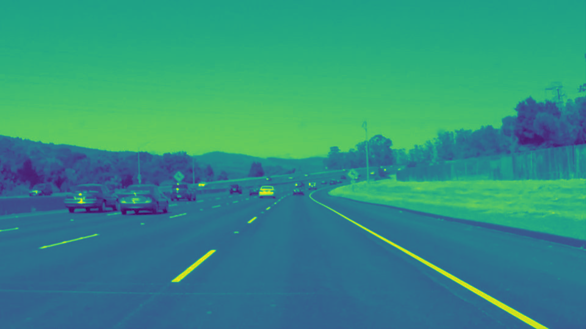
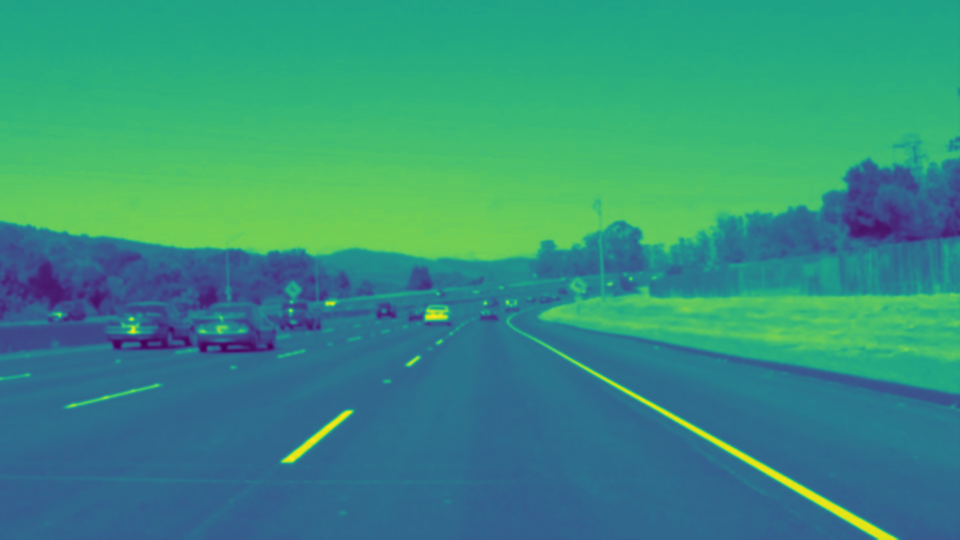

#**Finding Lane Lines on the Road**

---

**Finding Lane Lines on the Road**

The goals / steps of this project are the following:
* Make a pipeline that finds lane lines on the road
* Reflect on your work in a written report
---

## Reflection

### 1. Describe your pipeline. As part of the description, explain how you modified the draw_lines() function.

Before modifying the `draw_lines()` function, my pipeline consisted of 6 steps:

1. Convert the image to grayscale

2. Blur the image using gaussian method

3. Apply the Canny edge detection to find the image edge

4. Use a polygon to get the interested region containing the lane lines

5. Apply hough transformation to get the lines on the targeted region

6. draw the lines on the original image

Making modification on the `draw_lines()` function enables the program to interpolate the points on the lane lines and draw two solid lines on the lane lines.

I modified the `draw_lines()` function by taking the following steps:

1. I use the `cv.HoughLineP()` function to return all the lines that are in the target region. I use 50 for the largest gap threshold, 50 for minimum line length and 20 for the voting threshold. Selecting thresholds carefully allows the program to ignore very short lines and small objects that do not belong to the lane lines on the road, therefore making the lines more stable on the video.
2. After obtaining the lines from the last step, I extract all the points from the lines, and seperated them into left and right. I use a threshould that is the mid point of the top of the polygon to seperate the points.
3. After seperating the points, I use numpy's `polyfit()` function to fit two lines respectively to the left and right portions of the points, generating two sets of coefficients.
4. After getting the coefficients, draw each line using two points. One point is calculated using the intersection of the lane line and the bottom line where it's y value is equal to hight of the image - 540. The another point calculated is using the smallest y value in each set of points.
5. Use the draw function in opencv to draw the two lines on the image. Please see the following image below for the modified `draw_line()` function. In my code, the modified `draw_line()` function is renamed to `draw_lane_line()`.

### 2. Identify potential shortcomings with your current pipeline

There are several potential shortcomings with the current pipeline:

1. The polygon is not self-adjustable to the shape of the lane lines form, meaning that if the lane lines go out of the polygon region or some random objects, for example, another lane line or some white fence next to the road, runs into the polygon, it is likely to mess up the hough line detection algorithm.
2. It only works for situations when there are high contrast between the lane lines and the street. If the environment is dark, it is possible that the lane lines will not be detected anymore because it will be filtered out in the edge detection step.

###3. Suggest possible improvements to your pipeline

A possible improvement would be to figure out a way to make the polygon dependent to the location of the two lane lines, so they can be self adjustable to different angles of the camera and the different forms shaped by the lane line.

Another potential improvement could be to allow the program auto adjust the threshold based on the environment data input for a more accurate edge detection.
